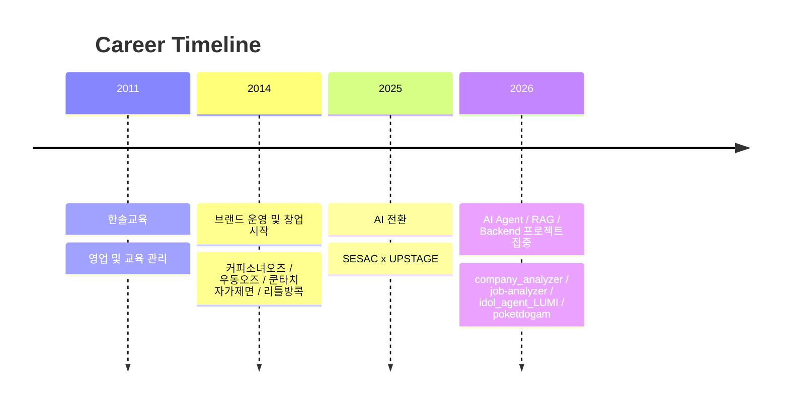
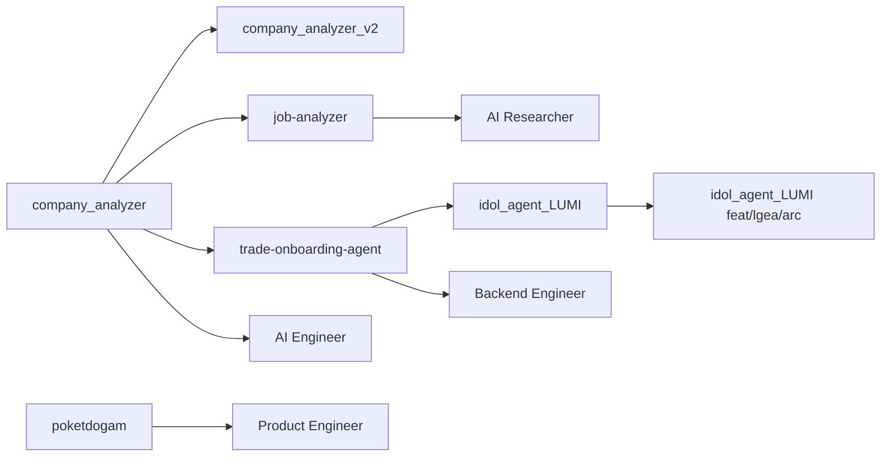

# 이영기 | AI Engineer · AI Researcher · Backend Engineer · Product Engineer

현장의 운영 문제를 직접 겪고 구조화한 뒤, 이를 데이터와 AI 기반 시스템 설계로 다시 풀어내는 문제 해결형 엔지니어입니다. 교육 영업, 브랜드 운영, 프랜차이즈 현장, 창업과 폐업, 그리고 AI 전환 이후의 공개 프로젝트 경험을 바탕으로 `설명 가능한 문제 해결`에 강점을 두고 있습니다.

## Quick Links
- [Resume](./resume.md)
- [Portfolio](./portfolio.md)
- [Cover Letter](./cover-letter.md)
- [Projects](./projects/README.md)
- [GitHub](https://github.com/atozwizard)
- [Gist](https://gist.github.com/atozwizard)

## Contact
- Email: `at.oz.wizard@gmail.com`
- Phone: `(+82) 010-2589-0897`
- Location: `Seoul, Korea`

## Positioning
- 1st: `AI Engineer`
- 2nd: `Backend Engineer`
- 3rd: `Product Engineer`
- Extended: `AI Researcher - NLP, LLM`

## Strengths
- 비즈니스 문제를 기술 문제로 번역할 수 있습니다.
- 운영 병목을 데이터와 프로세스 기준으로 해석할 수 있습니다.
- 프로젝트를 `무엇을 만들었는가`보다 `왜 그렇게 풀었는가` 기준으로 설명할 수 있습니다.
- 정성 근거와 정량 근거의 한계를 구분해 과장 없이 서술할 수 있습니다.

## Timeline

## Project Map

## Representative Projects
- `company_analyzer`: 기업 요구 역량과 사용자 역량을 연결하는 멀티에이전트 분석 구조
- `company_analyzer_v2`: 설명 가능한 요구 역량 추론과 포트폴리오 생성형 분석 확장 구조
- `job-analyzer`: AST + 임베딩 기반 저장소 해석 및 JD 연결
- `trade-onboarding-agent`: 상태 일관성과 업무 흐름 안정성을 다룬 온보딩 에이전트
- `idol_agent_LUMI`: 운영형 AI 서비스 구조
- `idol_agent_LUMI feat/lgea/arc`: LLM 평가 연구 브랜치
- `poketdogam`: 사용자 경험과 인터랙션 설계 중심 서비스 프로젝트

세부 내용은 [projects](./projects/README.md)에서 확인할 수 있습니다.
