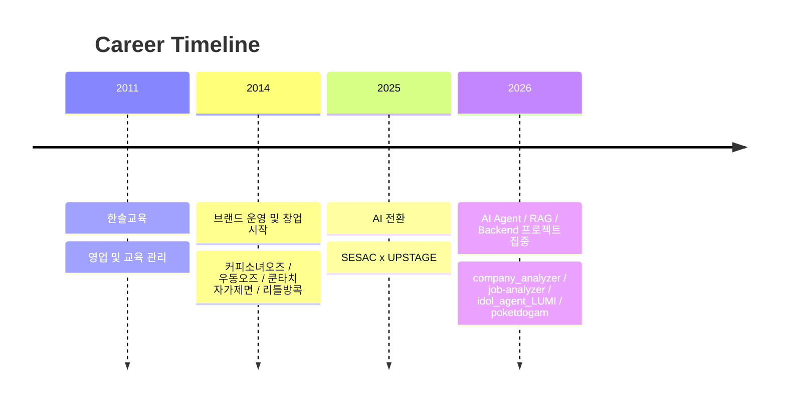

# 이영기 | AI Engineer · AI Researcher · Backend Engineer · Product Engineer

현장의 결핍을 구조화해 설명 가능한 시스템으로 바꾸는 개발자입니다. 교육 영업, 브랜드 운영, 창업과 실패, AI 전환 이후의 프로젝트 경험을 하나의 축으로 묶어 `문제를 기술 구조로 번역하고 다시 서비스로 연결하는 일`을 해 왔습니다.

## Start Here
- [Landing Page](./index.html)
- [Developer Story](./developer-story.md)
- [Resume](./resume.md)
- [Portfolio](./portfolio.md)
- [Cover Letter](./cover-letter.md)
- [Projects](./projects/README.md)

## Core Story
저는 현장에서 반복적으로 발생하는 병목과 비효율을 감각이 아니라 구조로 설명하고 싶었습니다. 교육 영업 현장에서는 운영 구조를 정리해 성과를 확장했고, 브랜드 운영과 창업 현장에서는 상권 제약, 조리 병목, 고객 경험 문제를 직접 다뤘습니다. AI 전환 이후에는 그 경험을 바탕으로 `company_analyzer`, `job-analyzer`, `trade-onboarding-agent`, `idol_agent_LUMI`, `poketdogam` 같은 프로젝트를 통해 설명 가능한 분석과 운영형 AI 서비스 구조를 구현하고 있습니다.

## Positioning
- 1st: `AI Engineer`
- 2nd: `Backend Engineer`
- 3rd: `Product Engineer`
- Extended: `AI Researcher - NLP, LLM`

## Representative Projects
- [company_analyzer](./projects/company_analyzer.md)
- [company_analyzer_v2](./projects/company_analyzer_v2.md)
- [job-analyzer](./projects/job-analyzer.md)
- [trade-onboarding-agent](./projects/trade-onboarding-agent.md)
- [idol_agent_LUMI](./projects/idol_agent_LUMI.md)
- [idol_agent_LUMI_feat_lgea_arc](./projects/idol_agent_LUMI_feat_lgea_arc.md)
- [poketdogam](./projects/poketdogam.md)
- [manufacturing-ai-coach](./projects/manufacturing-ai-coach.md)

## Contact
- Email: `at.oz.wizard@gmail.com`
- Phone: `(+82) 010-2589-0897`
- GitHub: [atozwizard](https://github.com/atozwizard)
- Gist: [atozwizard](https://gist.github.com/atozwizard)

## Timeline

